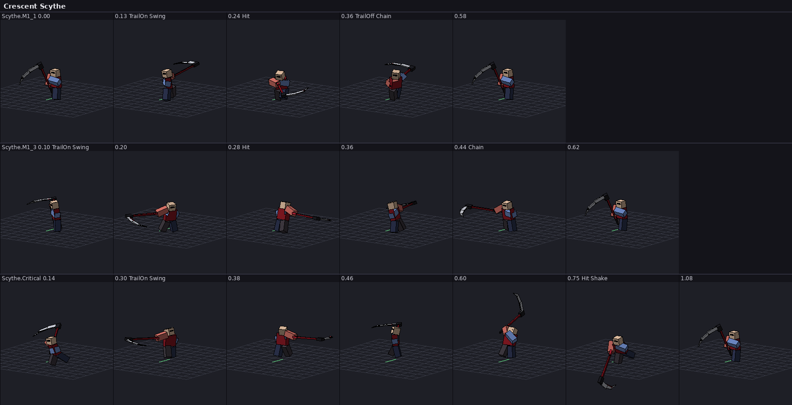
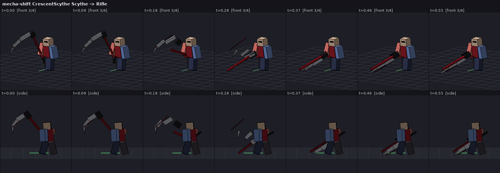

# RWBY: Shattered Moon

An action RPG for Roblox in the style of Deepwoken and Type Soul, set in Remnant from RWBY. You make a
Huntsman, roll a Semblance, pick a mecha-shift weapon and fight Grimm (or other players) with
posture, parries and Aura.

This is an unofficial fan project; see [Legal](#legal).




*The images above are offline renders of the game's own animation code (see `tools/preview`).*

## Features

- **Combat in the style of Deepwoken.**
  - M1 strings and weapon criticals.
  - Feints, block and timed parries.
  - Posture with guard breaks.
  - Dodges with i-frames, air dashes and slides.
  - Backstabs, hyper armor, unparryable attacks (flagged with a red glint) and status effects (burn, chill, shock, slow).
  - Hitstop and camera shake.
  - The server runs all combat. The client predicts its own actions so input feels instant.
- **Aura.** A soul shield that absorbs damage before Health. When it shatters you stagger and take extra damage until it regenerates.
- **Knocked and executions.** Players at 0 HP are knocked rather than killed. They get back up after a while unless someone executes them first. Grimm maul knocked players.
- **Mecha-shift weapons.** Each weapon has two forms, and pressing T switches between them with an animated piece-by-piece transformation:

  | Weapon | Form 1 | Form 2 |
  |---|---|---|
  | Crescent Scythe | Scythe | Sniper rifle (its recoil launches you) |
  | Ember Gauntlets | Fists | Shotgun |
  | Aegis Blade | Sword and shield | Greatsword |
  | Thunder Hammer | Hammer | Grenade launcher |
- **Semblances.** Six of them (Velocity, Shadow, Retribution, Polarity, Glyph, Bulwark). Your Semblance is rolled by rarity, and you can reroll it with Semblance Spins. Each has an active ability and a passive.
- **Dust.** Fire, Ice, Lightning and Gravity techniques. Each cast uses up a vial; buy more at the Dust shop in Vale.
- **Grimm.** Beowolves, Alpha Beowolves and Ursai. They chase, circle and use telegraphed attacks.
- **Your Huntsman.** Character creation covers:
  - Name and kingdom (Vale, Atlas, Mistral or Vacuo, each with a bonus).
  - Human or Faunus heritage. Faunus get ears, horns or a tail, plus night vision.
  - A signature color.
  - A starting weapon.

  You level up to 30 and spend points on five attributes. Lien and Dust vials are saved with session-locked DataStores.
- **Remnant.** The map includes:
  - Beacon Academy on its cliff (safe zone), with launch pads into the Emerald Forest.
  - Vale's commercial district (safe zone), with the Dust shop.
  - The Emerald Forest with its ruined temple.
  - Forever Fall.
  - The shattered moon overhead, and a day/night cycle.
- **Custom animation engine.** Every motion comes from code: procedural locomotion plus keyframe clips with easing, layering, two-hand IK and spring-based reactions. You don't need to upload any animation assets. See [docs/ANIMATION.md](docs/ANIMATION.md).

Game design details and tuning numbers are in [docs/DESIGN.md](docs/DESIGN.md).

## Getting started

You need Roblox Studio and [Rokit](https://github.com/rojo-rbx/rokit), the toolchain manager. Rokit installs Rojo and the other tools at the versions pinned in `rokit.toml`.

```sh
rokit install
rojo build default.project.json -o RWBY-ShatteredMoon.rbxl
```

1. Open `RWBY-ShatteredMoon.rbxl` in Roblox Studio and press **Play**. The world is generated when the server starts, and the character creator opens on your first join.
2. For live editing, run `rojo serve` and connect with the [Rojo Studio plugin](https://rojo.space/docs/v7/getting-started/installation/). Code changes then sync into Studio as you save.
3. To save progress in Studio, publish the place, then turn on *Game Settings → Security → Enable Studio Access to API Services*. Without it the game warns once and uses temporary in-memory profiles.
4. Characters are always R6 (the server builds them), so the place's avatar settings don't matter.

Every push also builds the place file in CI, as the downloadable `RWBY-ShatteredMoon` artifact on the workflow run.

## Controls

| Action | Keyboard / mouse | Gamepad |
|---|---|---|
| Attack (or shoot, in ranged forms) | Left mouse | R2 |
| Feint (melee) / aim (ranged) | Right mouse | L2 |
| Critical | R | X |
| Block (raise it just before a hit to parry) | F (hold) | L1 |
| Dodge (air dash when airborne) | Q | B |
| Mecha-shift weapon | T | D-pad up |
| Semblance | E | R1 |
| Dust techniques | 1 2 3 4 | D-pad left / down / right, R3 |
| Execute a knocked enemy | B | Y |
| Slide (while sprinting) | C | Y while sprinting |
| Sprint | Hold Shift, or double-tap W | L3 |
| Character menu (stats, attributes, Semblance) | M | Select |
| Weapon lockers (Beacon) / Dust shop (Vale) | G at the prompt | Y at the prompt |

## Project layout

```
default.project.json     Rojo tree: src/shared → ReplicatedStorage.Shared, src/server → ServerScriptService,
                         src/client → StarterPlayerScripts, plus Lighting/Players/StarterPlayer settings
src/shared/
  Animation/             animation engine (Joints, Clip, Composer, Locomotion, WeaponShift, …)
    Clips/               keyframe clips per weapon, Common (dodges, hit reactions, abilities) and Grimm
  Config/                all game data and tuning: Combat, Weapons, WeaponModels, Semblances, Dust,
                         Grimm, Origins, Progression, World, Sounds
  Net.luau, Util/        remotes, signals, physics impulses, rig helpers
src/server/
  Combat/                Combatant state, CombatService (hit resolution, moves), hitboxes, projectiles,
                         Semblance and Dust abilities
  Characters/            R6 rigs, appearance, weapon models
  Grimm/                 Grimm spawning and AI
  Services/              DataStore profiles, progression and rewards, menu requests
  World/                 procedural map builder, lighting and time of day
src/client/
  Animation/             CharacterAnimator: drives every rig's Motor6Ds each frame
  Controllers/           input, combat prediction, movement, camera, VFX/SFX, HUD, menus, world
tests/                   Lune unit tests (animation math, content integrity, combat rules, configs)
tools/lune/harness.luau  emulates Rojo's instance tree so shared/server modules run under Lune
tools/preview/           offline pose renderer: export frames with Lune, draw contact sheets with Python
```

## Development

The commands below are the same checks CI runs (`.github/workflows/ci.yml`):

```sh
stylua --check src tests tools      # formatting
selene src tests tools              # lint
lune run tests/run.luau             # unit tests
```

Type checking uses strict mode with the Roblox API definitions:

```sh
rojo sourcemap default.project.json -o sourcemap.json
curl -fsSL -o globalTypes.d.luau \
  https://raw.githubusercontent.com/JohnnyMorganz/luau-lsp/1.70.1/scripts/globalTypes.None.d.luau
luau-lsp analyze --definitions=globalTypes.d.luau --sourcemap=sourcemap.json \
  --no-strict-dm-types --flag:LuauSolverV2=false src/
```

To preview animations without Studio, export frames with Lune and draw them with Python. The Python step needs `pillow` and `numpy`.

```sh
lune run tools/preview/export.luau /tmp/frames.json sheet Scythe.M1_1 Scythe.M1_2 Scythe.Critical \
  stance=Scythe.Scythe weapon=CrescentScythe form=Scythe
python3 tools/preview/render.py /tmp/frames.json /tmp/moveset.png
```

Other exporter modes:
- `clip <id>`: one clip.
- `loco <speed>`: the walk/run cycle.
- `stance`: a weapon stance.
- `shift <from> <to>`: a mecha-shift.

The header of `tools/preview/export.luau` lists every option.

## Status and known limitations

This is a complete vertical slice, but it was written without a Studio playtest. All of the following passed:
- strict type checking
- linting
- 53 unit tests
- offline renders of every moveset and transformation
- a successful `rojo build`

Gameplay feel (timings, speeds, damage) has not been tuned by playing, so expect to adjust the numbers in `src/shared/Config`. Known gaps:

- **Sounds** are Roblox's built-in `rbxasset://` placeholders. Swap in your own uploads in `src/shared/Config/Sounds.luau`.
- **Grimm** move straight toward their target. They hop when stuck, but there's no pathfinding around large obstacles.
- **Controls** cover keyboard, mouse and gamepad. There are no touch controls yet.
- **Character looks** are blocky R6 characters with built-in accessories (Faunus traits, capes) and part-built weapons. There are no custom meshes.

## Legal

RWBY was created by Monty Oum and produced by Rooster Teeth. RWBY, its names and its world belong to their rights holders. This project isn't affiliated with or endorsed by them.

It uses no canon characters and no official assets; the weapons are original designs inspired by the show. Even so, the RWBY name and setting can attract takedowns, especially if the game is monetized. Rebrand the game, or get permission, before publishing it widely.
